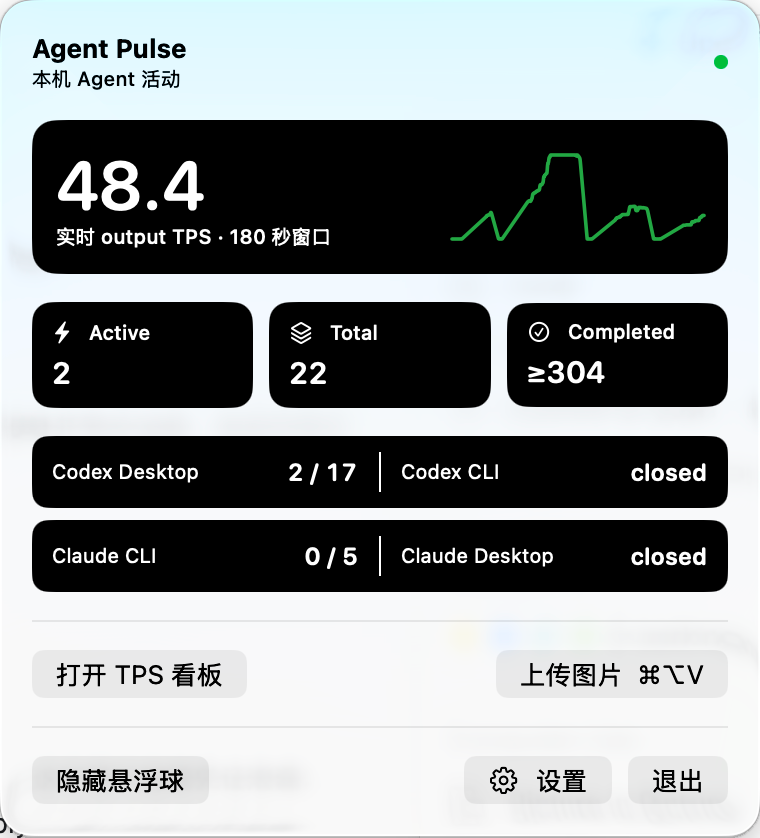
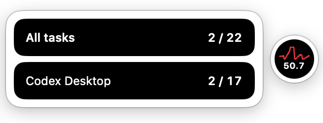
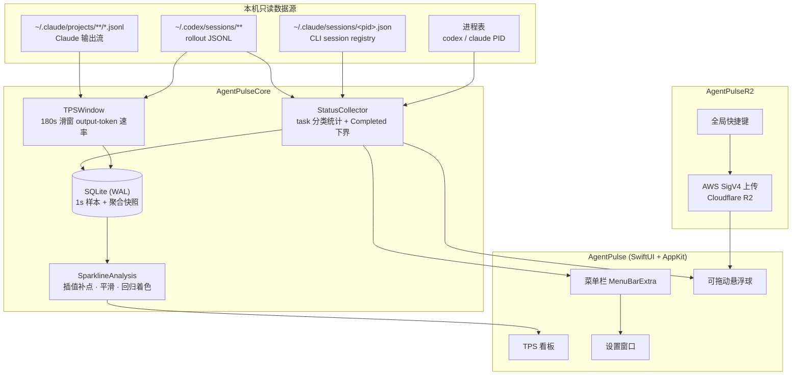

# Agent Pulse

<p align="center">
  
  
  
  <a href="LICENSE"></a>
</p>

<p align="center"><strong>把 Codex / Claude 的任务状态、实时 output TPS、长期 Token 统计和 R2 图片上传收进菜单栏与悬浮球。</strong></p>

<p align="center">
  
  &nbsp;&nbsp;
  
</p>

## ✨ 功能亮点

- **四类 task 分类统计**：Codex Desktop、Codex CLI、Claude CLI、Claude Desktop 的 total / active 分别统计，界面同时展示汇总结果。
- **实时 TPS 曲线**：每秒采样一次，180 秒滑窗 output-token 速率；看板保留总曲线并叠加真实分模型曲线，最新模型 TPS 在竖向图例中一位小数展示。
- **趋势着色**：基于最近 15 分钟序列做线性回归，下降超阈值才判定为下降，其余视为稳定/上升，可在设置中互换涨跌配色。
- **可拖动悬浮球**：跟随鼠标拖动到任意屏幕位置；单击弹出 task 概览，双击弹出 TPS 看板，点击外部自动收起。
- **剪贴板图片上传 R2**：全局快捷键把剪贴板图片上传到 Cloudflare R2，返回可复制的公开 URL。
- **冷启动缓存**：SQLite 保存最近一次聚合快照，重启后立即显示缓存值，后台重建 baseline 完成后切换为实时值。
- **长期 Token 统计**：本地 SQLite 追加保存 Codex / Claude token 用量；删除历史 session 文件不影响已入库统计。

---

## 🖥 界面与交互

| 载体 | 交互 | 展示内容 |
|---|---|---|
| 菜单栏 | 点击图标展开菜单 | 2×2 来源区（Codex Desktop / Codex CLI / Claude CLI / Claude Desktop）+ TPS + Token 汇总 + 设置入口 |
| 悬浮球 | 拖动 | 跟随鼠标移动到任意屏幕位置并记忆坐标 |
| 悬浮球 | 单击 | 任务概览气泡：`All tasks` 置顶，只列出 active > 0 的来源，按 active/total 排序 |
| 悬浮球 | 双击 | TPS 看板：在悬浮球所在屏幕居中打开，展示带坐标轴的实时曲线与涨跌着色 |
| 任意气泡/看板 | 点击外部区域 | 自动收起 |

---

## 🏗 架构总览



- `AgentPulseCore`：采集、TPS 滑窗、曲线分析、SQLite 快照与长期 Token 账本，纯逻辑、可独立验证。
- `AgentPulseR2`：剪贴板图片编码、对象 Key 生成、AWS SigV4 签名与 R2 上传。
- `AgentPulseReporting` / `AgentPulseUsage`：配置驱动的可选上报传输与长期账本映射；默认不配置目标或凭证命令。
- `AgentPulse`：SwiftUI + AppKit 外壳，菜单栏、悬浮球、看板、设置与全局快捷键。

---

## 📊 支持的数据源与 task 口径

> 全部为本机只读；采集只解析统计所需的元数据，不保存、不上传、不展示会话正文、标题、cwd 或凭证。

| 来源 | total 口径 | active 口径 |
|---|---|---|
| **Codex Desktop** | `~/.codex/sessions` 中顶层、非 automation 的 distinct session | 最后生命周期为 `task_started`，且最近 5 分钟仍有 rollout 或结构化 output 活动 |
| **Codex CLI** | 当前独立 `codex` 进程数（排除 `.app/Contents` helper） | 有存活进程且在当前 sessions 找到顶层 `codex_exec` 的最近 `task_started` rollout（不超过 total） |
| **Claude CLI** | 存活且 basename 为 `claude` 的 PID，`kind=interactive`、`entrypoint=cli` 的匹配 registry | 仅 `status=busy` 计入；`idle` 与陈旧 registry 不计 |
| **Claude Desktop** | Claude.app 运行时，`~/.claude/projects/**/*.jsonl` 中顶层 `entrypoint=claude-desktop-3p` 的 distinct session | 最近 5 分钟仍有活动，且尾部处于等待模型或仍在生成的会话 |

- Codex 的 `archived_sessions` 与 `automations` 目录记录完全不参与 task 或 Completed 统计。
- 进程退出后，CLI 的 total/active 会在下一次采样归零；未打开的 CLI 不统计。
- **Completed** 仅来自当前 sessions 中可读的本地 rollout，始终标记为 lower bound（界面显示 `≥N`）；cwd 任一路径段精确等于 `automations` 的记录会被排除。

---

## 📈 TPS 与趋势口径

- **窗口**：汇总 Codex Desktop、Codex CLI 与 Claude CLI（递归读取 `~/.claude/projects/**/*.jsonl`）最近 180 秒的 output/completion token，除以固定分母 180；不计 input、cached input 或 reasoning token。
- **采样**：每秒一次，固定显示一位小数。
- **摊分**：累计 output 计数先做相邻差分，计数器下降时只重建基线；两次观测之间的增量按与 180 秒窗口的重叠比例线性摊分，避免末秒假尖峰。
- **状态**：区分 `live` / `zero` / `no_data` / `stale` / `unavailable`；最后一个有效 output 信号超过 5 分钟即为 `stale`。
- **曲线**：从内存与 SQLite 恢复最近 15 分钟、最多 900 个数值点；每秒样本同时保存总量与 `model → window tokens`，总曲线及分模型曲线独立绘制；内部缺口按相邻值插值、窗口边缘按最近值延展后再平滑。
- **趋势着色**：对补点、平滑后的序列做线性回归，下降超过阈值才判定为下降，阈值内视为稳定，正增长判定为上升；涨跌配色可在设置中互换。
- Claude 的子 agent JSONL 也按本地实际输出计入 TPS，但不会进入 Desktop/Codex task 或 Completed 计数。

---

## 🚀 Quick Start

要求 macOS 14+ 与 Swift 6.3+。

```bash
# 直接运行
swift build
swift run AgentPulse
```

生成可直接打开的 ad-hoc 签名 App bundle：

```bash
scripts/package-app.sh
open dist/AgentPulse.app
```

---

## 🪙 Token 统计与可选上报

- 本地扫描 `~/.codex/sessions/**/*.jsonl` 与 `~/.claude/projects/**/*.jsonl`，事件追加写入独立 SQLite，并聚合为 30 分钟 bucket。
- 菜单汇总展示总 Tokens、估算费用、缓存/新增、缓存命中率与实时 TPS；无数据时不以 0 冒充。
- 只保存统计维度、token 计数和 hash 后的 session/source-file 标识，不保存正文、标题、完整 cwd 或凭证。
- 本地长期采集默认开启（仅写本机 SQLite）；上报默认关闭。API 地址为空、canonical hostname 缺失或 `reporting.json` 不完整时都无法启用上报，也不会发起任何网络请求或外部进程。
- 开启自动上报后会立即执行一次“扫描 → 上报”，此后每 30 分钟重复；关闭开关会停止后续周期，配置失效时会持久化关闭，不会在配置恢复后自行重新开启。
- `reporting.json` 中的 path、header 名、静态 header、取 token 命令及 JSON key path 均由用户配置；仓库不提供环境相关默认值，token 仅在请求期间驻留内存。

### 上报协议要点

- **配置权限**：`reporting.json` 必须为 `0600`（仅属主可读写），否则视为无效配置并拒绝加载。
- **传输安全**：生产地址只接受 `https`；`http` 仅在 loopback（`localhost` / `127.0.0.1` / `::1`）时放行。base URL 不得携带用户名、密码、query 或 fragment。
- **canonical hostname**：以配置中的 canonical hostname 作为上报身份；它必须与账本记录的 hostname 一致，不一致或未设置时要求先重建，绝不回退到系统主机名。
- **完整累计值**：普通上报发送本地账本中该设备每个 bucket 的完整累计值，而非单次增量，服务端做幂等 upsert。
- **严格 ACK**：仅当响应逐维度精确回执（buckets / sessions 数量完全一致）时才标记已同步；`2xx {}`、字段缺失、少计或多计一律保持 pending。
- **按 revision 精确对账**：每行携带 revision 快照，ack 时按（自然键 + revision 快照）精确匹配；上传期间被重算的行不会被误 ack，保持 dirty。
- **删除即 fail-closed**：删除已同步的派生数据会置位全局对账门禁，普通上报在对账完成前保持禁用，避免远端与本地静默失配。
- **全量同步就绪门禁**：full sync 需要 `reporting.json` 携带完整且合法的 `fullSync` 协议段；缺失或不完整时状态保持 blocked（未就绪），不会发起任何请求。

### 谁开谁报、累计 upsert 与 Full Sync

- **谁开谁报（本机 opt-in）**：本地长期采集与上报是两个相互独立的开关——采集默认开启（仅写本机 SQLite），上报默认关闭；只有在本机显式打开上报、填好 API 地址与 canonical hostname、且 `reporting.json` 校验通过时，这台设备才会以自己的 canonical hostname 作为上报身份上报自身账本。未开启上报的设备只在本地统计，不上报，也不代任何其他设备上报。
- **普通上报 = 累计值幂等 upsert**：每一轮普通上报发送本地账本中该设备**每个 bucket 的完整累计值**（并非单次增量），服务端据此做幂等 upsert。因此漏报、乱序或重试都能自愈：相同自然键重复提交只会覆盖为同一累计值，不会重复累加。
- **Full Sync 与普通上报的区别**：普通上报是持续、增量触发（启动一次 + 每 30 分钟）、只推送 dirty 行的累计值，服务端做幂等 upsert；Full Sync 则是一次显式的“把本机全部派生行与远端对齐”的修复动作，不依赖上报开关，可在上报关闭时手动执行。它先读取本地 generation 基线并固定账号身份，再向服务端 `reserve` 围栏；只有围栏持久化成功后，才读取同一 generation 的本地快照并执行 `begin → stage → commit`。分块 kind 为 `buckets`、`sessions`、`autonomy`，其中 autonomy 的行数组字段仍为 `autonomySessions`。远端确认 commit 后，本机才对账本做原子 commit（以 generation 与逐行 revision 快照为围栏）。若 reserve 后、快照前崩溃，会在 generation 未变化时复用原围栏；若远端已 commit 但本地 commit 前崩溃/重启，下次会命中幂等 committed 分支并重跑本地 commit。
- **历史源删除触发 reconciliation gate、Full Sync 修复后清除**：远端协议暂不支持 tombstone。一旦本地重算删除了曾经 ack 过的 bucket/session 自然键（例如清理或改动历史数据源导致派生行消失），会置位全局对账门禁（reconciliation required）并 fail-closed —— 在对账完成前普通上报持续禁用，界面给出被阻原因，防止远端保留本地已不存在的旧行造成静默失配。该门禁持久化，不会因下一次“无变化”的 finalize 自动解除；只有成功跑完一次 Full Sync（远端 commit 成功后本地账本原子 commit）才会清除对账门禁并恢复上报资格。即使本机已无待同步行，只要门禁已置位，Full Sync 仍会完整走一遍协议、由远端据整份快照删除旧行并回执确认，再清除门禁。
- **API 地址仅本机配置、不随用量上传**：上报目标（base URL）只保存在本机应用偏好中，仅在发起上报时于内存中拼接请求；它既不写入账本 SQLite，也**不会作为任何字段包含在上传的用量 payload 里**。上传内容仅为聚合后的用量维度、token 计数与 hash 后的标识，不含地址、凭证、路径或会话正文。

默认配置路径（文件由用户自行创建，缺失即保持本地模式）：

```text
~/Library/Application Support/AgentPulse/reporting.json
```

配置文件格式（全部为占位示例，请替换为你自己的服务端约定）：

```json
{
  "canonicalHostname": "your-device-name",
  "path": "/your/ingest/path",
  "headers": {
    "authToken": "Authorization",
    "timeZoneOffset": "X-Timezone-Offset",
    "locale": "X-Locale",
    "contentEncoding": "Content-Encoding",
    "contentType": "Content-Type"
  },
  "staticHeaders": [
    { "name": "X-Your-Static-Header", "value": "your-value" }
  ],
  "tokenCommand": {
    "executable": "/absolute/path/to/your-token-cli",
    "arguments": ["print-token"],
    "forceRefreshArguments": ["print-token", "--refresh"],
    "statusKey": "status",
    "successStatus": "ok",
    "errorKey": "error",
    "tokenKeyPath": ["data", "accessToken"]
  },
  "fullSync": {
    "path": "/your/full-sync/path",
    "actionNames": { "reserve": "reserve", "begin": "begin", "stage": "stage", "commit": "commit" },
    "kindNames": { "buckets": "buckets", "sessions": "sessions", "autonomySessions": "autonomy" },
    "maxRowsPerChunk": 2000,
    "maxBytesPerChunk": 8388608
  },
  "localeEnvironmentVariables": ["LC_ALL", "LANG"],
  "batch": { "maxBucketsPerBatch": 500, "maxSessionsPerBatch": 1000, "maxConcurrentBatches": 2 },
  "retry": { "maxRetries": 3, "retryableStatusCodes": [502, 503, 504], "backoffSeconds": [2, 5, 11] }
}
```

创建后请立即收紧权限：

```bash
chmod 600 ~/Library/Application\ Support/AgentPulse/reporting.json
```

base URL（API 地址）单独在设置中配置、仅保存在本机应用偏好（UserDefaults），发起上报时于内存中拼接请求，不写入账本 SQLite，也不会作为任何字段包含在上传的用量 payload 里。它按上述传输安全规则校验。取 token 命令的输出由 `statusKey` / `successStatus` / `errorKey` / `tokenKeyPath` 解析，token 不写入 SQLite、UserDefaults 或日志。

---

## 🖼 剪贴板图片上传 R2

在菜单栏的「设置…」→「R2 图片上传」中可修改配置文件位置，默认位于当前用户家目录：

```text
~/.claude/.credentials/env/agent-pulse-r2.env
```

配置文件格式（全部为占位示例）：

```dotenv
R2_ACCOUNT_ID=your-account-id
R2_ENDPOINT=https://<account-id>.r2.cloudflarestorage.com
R2_BUCKET=your-bucket
R2_PUBLIC_BASE_URL=https://cdn.example.com
R2_ACCESS_KEY_ID=your-access-key-id
R2_SECRET_ACCESS_KEY=your-secret-access-key
```

复制剪贴板图片后按 `⌘⌥V` 即可上传，成功后悬浮球会弹出可复制的公开 URL 气泡，并在 3 秒后自动消失。

应用只把 `.env` 的路径保存到 UserDefaults，配置值只在上传时读入内存。请勿把 `.env`、访问密钥、签名请求或预签名 URL 写入仓库或日志。

---

## 🔌 cliproxyapi 用量采集

在菜单栏的「设置…」→「cliproxyapi 用量采集」中可修改配置文件位置，默认位于当前用户家目录：

```text
~/.claude/.credentials/env/agent-pulse-cliproxy.env
```

配置文件格式（全部为占位示例）：

```dotenv
CLIPROXY_BASE_URL=http://your-cliproxy-host:port
CLIPROXY_MANAGEMENT_KEY=your-management-secret-key
CLIPROXY_TARGET_API_KEY=sk-the-apikey-to-monitor
```

创建后请立即收紧权限：

```bash
chmod 600 ~/.claude/.credentials/env/agent-pulse-cliproxy.env
```

- 采集在本地长期采集的同一节奏（应用启动一次 + 每 30 分钟）随扫描触发：拉取 cliproxyapi management 的 `GET /v0/management/usage`，在**本地**按目标 apikey 的 `SHA256` 与响应中的 `api_key_hash` 精确比对，只提取目标 key 的 token 用量。
- 用量以来源 `cliproxy` 并入既有 usage 账本与上报链路（30 分钟 bucket、按 revision 精确对账），复用现有上报开关与协议，不新造上报通道。
- 鉴权用 `Authorization: Bearer <management-key>`；生产地址要求 `https`，`http` 仅在 loopback 或私有内网地址放行。响应无界，设有最大字节保护，超限或拉取失败时**跳过本轮**，绝不影响本地文件采集与既有链路。
- 配置文件必须为 `0600`，否则视为无效并禁用采集（不崩溃）。应用只把 `.env` 的**路径**保存到 UserDefaults；base URL、management key、目标 apikey 只在采集时读入内存，绝不写入 UserDefaults、SQLite 或日志。账本只保存 hash 后的 key 身份、model、token 计数与时间，不含明文 key、掩码 source、地址或正文。

---

## 💾 本地数据库

每秒 TPS 样本写入应用自己的 SQLite 数据库（WAL 模式）：

```text
~/Library/Application Support/AgentPulse/agent-pulse.sqlite
```

- 1 秒样本保留 6 小时且最多 21,600 条。
- `no_data` / `stale` / `unavailable` 以空值保存，绘图时再插值补点；可用样本同时持久化按模型拆分的窗口 token，旧数据库记录可向后兼容读取。
- 额外保存一条不含路径或会话内容的聚合指标快照，供重启后即时展示。

长期 Token 账本使用独立 SQLite 文件：

```text
~/Library/Application Support/AgentPulse/usage.sqlite3
```

- schema v4、WAL 模式；分层保存原始 token/session 事件、派生的 30 分钟聚合 bucket 与 session、源文件 checkpoint 与按 hostname 隔离的同步状态。
- 派生行逐行携带 revision 与 synced_revision：revision 大于 synced_revision 即为 dirty；ack 按（自然键 + revision 快照）精确匹配，避免误 ack 上传期间被重算的行。
- 删除已同步的派生数据会置位全局对账门禁（reconciliation required），在对账完成前普通上报 fail-closed。
- 源文件删除后已入库历史仍保留；未变化文件按 size、mtime 与 parser version 跳过。

---

## ✅ 构建与验证

在没有 XCTest 模块的 Swift 环境中，使用独立的验证可执行文件：

```bash
swift run AgentPulseCoreVerification   # 核心采集 / TPS / 曲线逻辑
swift run AgentPulseR2Verification     # R2 签名 / Key / URL
swift run AgentPulseReportingVerification # 通用上报传输层
swift run AgentPulseUsageVerification     # 账本到上报 payload 的离线组装
```

读取本机真实数据的脱敏 smoke，只输出聚合数与状态，不输出会话 ID、标题、cwd、正文或凭证：

```bash
swift run AgentPulseCollectorSmoke
```

---

## 🔒 隐私与安全

- 默认仅本地；未显式开启或配置不完整时不发起上报。
- 只解析统计所需的日志字段；不保存、不上传、不展示会话正文、标题或完整 cwd。
- 不在仓库或日志中写入 credential、签名请求或预签名 URL；R2 配置值仅在上传时读入内存。
- SQLite 仅保存聚合数值、hash 标识与不含路径/正文的快照。
- 可选上报不内置 API 地址、环境专用 header 或取 token 命令，凭证不会写入 SQLite、UserDefaults 或日志。

---

## ⚠️ 已知限制

- 首次安装需扫描可读的 Codex/Claude JSONL，历史较多时冷扫可能需要几十秒；历史 token 只用于建立安全 baseline，不会回放成实时 TPS。
- TPS 为固定 180 秒 output-only 速率，区间线性摊分是缺少逐 token 时间戳时的稳定估计，不能还原微观逐 token 速度。
- Completed 是可读本地 rollout 的下界，无法证明为非 automation 的记录不计入。
- 费用采用内置 fallback 单价估算，只用于本地观察，不构成账单数据。
- 全量同步需要 `reporting.json` 中完整合法的 `fullSync` 协议段并与配置权威 hostname 对齐；条件不满足时状态为“未就绪”、按钮禁用。

---

## 📁 文档

调研与设计资料位于 `docs/`；每项变更使用 `docs/changes/yyyy-mm-dd-change-name/` 独立归档，持久知识沉淀到 `docs/cookbook/`、`docs/pitfall/`、`docs/runbook/`。

---

## 📄 License

本项目基于 [MIT License](LICENSE) 开源。
