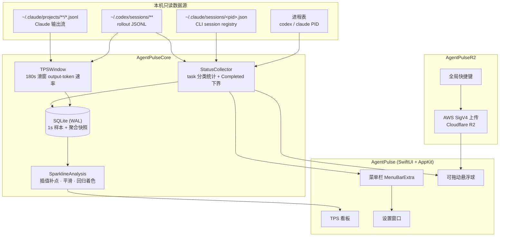

# Agent Pulse

<p align="center">
  
  
  
  <a href="LICENSE"></a>
</p>

<p align="center"><strong>把 Codex / Claude 的任务状态、实时 output TPS、长期 Token 统计和 R2 图片上传收进菜单栏与悬浮球。</strong></p>

<p align="center">
  
  &nbsp;&nbsp;
  
</p>

## ✨ 功能亮点

- **四类 task 分类统计**：Codex Desktop、Codex CLI、Claude CLI、Claude Desktop 的 total / active 分别统计，界面同时展示汇总结果。
- **实时 TPS 曲线**：每秒采样一次，180 秒滑窗 output-token 速率；看板保留总曲线并叠加真实分模型曲线，最新模型 TPS 在竖向图例中一位小数展示。
- **趋势着色**：基于最近 15 分钟序列做线性回归，下降超阈值才判定为下降，其余视为稳定/上升，可在设置中互换涨跌配色。
- **可拖动悬浮球**：跟随鼠标拖动到任意屏幕位置；单击弹出 task 概览，双击弹出 TPS 看板，点击外部自动收起。
- **剪贴板图片上传 R2**：全局快捷键把剪贴板图片上传到 Cloudflare R2，返回可复制的公开 URL。
- **冷启动缓存**：SQLite 保存最近一次聚合快照，重启后立即显示缓存值，后台重建 baseline 完成后切换为实时值。
- **长期 Token 统计**：本地 SQLite 追加保存 Codex / Claude token 用量，支持日 / 月 / 年 / 全部四个统计窗口；删除历史 session 文件不影响已入库统计。
- **工具与编辑指标**：按 30 分钟 bucket 统计 skill 调用、MCP 调用与已应用编辑的增删行，只保存名称和计数，不保存参数或补丁内容。

---

## 🖥 界面与交互

| 载体 | 交互 | 展示内容 |
|---|---|---|
| 菜单栏 | 点击图标展开菜单 | 2×2 来源区（Codex Desktop / Codex CLI / Claude CLI / Claude Desktop）+ TPS + 四窗口 Token 卡 + 设置入口 |
| 悬浮球 | 拖动 | 跟随鼠标移动到任意屏幕位置并记忆坐标 |
| 悬浮球 | 单击 | 任务概览气泡：`All tasks` 置顶，只列出 active > 0 的来源，按 active/total 排序 |
| 悬浮球 | 双击 | TPS 看板：在悬浮球所在屏幕居中打开，展示带坐标轴的实时曲线与涨跌着色 |
| 任意气泡/看板 | 点击外部区域 | 自动收起 |

---

## 🏗 架构总览



- `AgentPulseCore`：采集、TPS 滑窗、曲线分析、SQLite 快照与长期 Token 账本，纯逻辑、可独立验证。
- `AgentPulseR2`：剪贴板图片编码、对象 Key 生成、AWS SigV4 签名与 R2 上传。
- `AgentPulseReporting` / `AgentPulseUsage`：配置驱动的可选上报传输与长期账本映射；默认不配置目标或凭证命令。
- `AgentPulse`：SwiftUI + AppKit 外壳，菜单栏、悬浮球、看板、设置与全局快捷键。

---

## 📊 支持的数据源与 task 口径

> 全部为本机只读；采集只解析统计所需的元数据，不保存、不上传、不展示会话正文、标题、cwd 或凭证。

| 来源 | total 口径 | active 口径 |
|---|---|---|
| **Codex Desktop** | `~/.codex/sessions` 中顶层、非 automation 的 distinct session | 最后生命周期为 `task_started`，且最近 5 分钟仍有 rollout 或结构化 output 活动 |
| **Codex CLI** | 当前独立 `codex` 进程数（排除 `.app/Contents` helper） | 有存活进程且在当前 sessions 找到顶层 `codex_exec` 的最近 `task_started` rollout（不超过 total） |
| **Claude CLI** | 存活且 basename 为 `claude` 的 PID，`kind=interactive`、`entrypoint=cli` 的匹配 registry | 仅 `status=busy` 计入；`idle` 与陈旧 registry 不计 |
| **Claude Desktop** | Claude.app 运行时，`~/.claude/projects/**/*.jsonl` 中顶层 `entrypoint=claude-desktop-3p` 的 distinct session | 最近 5 分钟仍有活动，且尾部处于等待模型或仍在生成的会话 |

- Codex 的 `archived_sessions` 与 `automations` 目录记录完全不参与 task 或 Completed 统计。
- 进程退出后，CLI 的 total/active 会在下一次采样归零；未打开的 CLI 不统计。
- **Completed** 仅来自当前 sessions 中可读的本地 rollout，始终标记为 lower bound（界面显示 `≥N`）；cwd 任一路径段精确等于 `automations` 的记录会被排除。

---

## 📈 TPS 与趋势口径

- **窗口**：汇总 Codex Desktop、Codex CLI 与 Claude CLI（递归读取 `~/.claude/projects/**/*.jsonl`）最近 180 秒的 output/completion token，除以固定分母 180；不计 input、cached input 或 reasoning token。
- **采样**：每秒一次，固定显示一位小数。
- **摊分**：累计 output 计数先做相邻差分，计数器下降时只重建基线；两次观测之间的增量按与 180 秒窗口的重叠比例线性摊分，避免末秒假尖峰。
- **状态**：区分 `live` / `zero` / `no_data` / `stale` / `unavailable`；最后一个有效 output 信号超过 5 分钟即为 `stale`。
- **曲线**：从内存与 SQLite 恢复最近 15 分钟、最多 900 个数值点；每秒样本同时保存总量与 `model → window tokens`，总曲线及分模型曲线独立绘制；内部缺口按相邻值插值、窗口边缘按最近值延展后再平滑。
- **趋势着色**：对补点、平滑后的序列做线性回归，下降超过阈值才判定为下降，阈值内视为稳定，正增长判定为上升；涨跌配色可在设置中互换。
- Claude 的子 agent 转录（`subagents/*.jsonl`）不计入 TPS：子会话把父响应以不同 message.id / 文件路径重新落盘，跨文件无法按 message 身份折叠，若计入会把同一次真实 output 重复统计（约放大到数倍）。实时 TPS 只统计顶层会话文件，与 task / Completed 计数口径一致。

---

## 🚀 Quick Start

要求 macOS 14+ 与 Swift 6.3+。

```bash
# 直接运行
swift build
swift run AgentPulse
```

生成可直接打开的 ad-hoc 签名 App bundle：

```bash
scripts/package-app.sh
open dist/AgentPulse.app
```

---

## 🪙 Token 统计与可选上报

- 本地扫描 `~/.codex/sessions/**/*.jsonl` 与 `~/.claude/projects/**/*.jsonl`，事件追加写入独立 SQLite，并聚合为 30 分钟 bucket。
- 菜单 Token 卡支持日 / 月 / 年 / 全部四个窗口；每个窗口展示总 Tokens、估算费用、缓存 / 新增、缓存命中率，卡片底部展示实时 TPS；无数据时不以 0 冒充。
- Token 卡、分模型明细与 1 天 TPS 曲线会聚合账本中所有 hostname；canonical hostname 只约束本机新扫描数据的归属与上报身份，不过滤本地展示。
- 只保存统计维度、token 计数、工具名称与调用次数、编辑增删行和 hash 后的 session/source-file 标识，不保存正文、标题、完整 cwd、工具参数、补丁内容或凭证。
- 本地长期采集默认开启（仅写本机 SQLite）；上报默认关闭。API 地址（`REPORT_BASE_URL`）为空、canonical hostname（`REPORT_CANONICAL_HOSTNAME`）缺失或 `reporting.json` 协议结构不完整时都无法启用上报，也不会发起任何网络请求或外部进程。
- 开启自动上报后会立即执行一次“扫描 → 上报”，此后每 30 分钟重复；关闭开关会停止后续周期，配置失效时会持久化关闭，不会在配置恢复后自行重新开启。
- 凭证与上报简单值统一收敛到一个合并 `.env`（见「凭证配置」）；`reporting.json` 只保留纯协议结构（path、header 名、静态 header、runtime header 模板、取 token 命令及 JSON key path），由用户配置，仓库不提供环境相关默认值，token 仅在请求期间驻留内存。

如需从其他机器同步过来的 Claude-compatible JSONL 目录一并统计，可创建独立的本地来源配置：

```text
~/Library/Application Support/AgentPulse/local-sources.json
```

```json
{
  "localSources": [
    {
      "source": "home-machine",
      "root": "/absolute/path/to/transcripts",
      "format": "claude",
      "includeSubagents": true
    }
  ]
}
```

`source` 会归一化为最长 30 字符的 `[a-z0-9._-]` 标识，不能覆盖内建来源；`root` 必须是绝对路径，重复或嵌套目录会被拒绝。文件必须为 `0600`，配置缺失或无有效条目时仍只扫描内建来源。该文件只声明本机只读采集目录，不包含上报地址或凭证。

### 上报协议要点

- **配置权限**：`reporting.json` 必须为 `0600`（仅属主可读写），否则视为无效配置并拒绝加载。
- **传输安全**：生产地址只接受 `https`；`http` 仅在 loopback（`localhost` / `127.0.0.1` / `::1`）时放行。base URL 不得携带用户名、密码、query 或 fragment。
- **canonical hostname**：以合并 `.env` 的 `REPORT_CANONICAL_HOSTNAME` 作为上报身份；它必须与账本记录的 hostname 一致，不一致或未设置时要求先重建，绝不回退到系统主机名。
- **完整累计值**：上报发送本地账本中该设备每个 bucket 的完整累计值，而非单次增量，服务端始终做幂等 upsert。
- **严格 ACK**：仅当响应逐维度精确回执（buckets / sessions 数量完全一致）时才标记已同步；`2xx {}`、字段缺失、少计或多计一律保持 pending。
- **按 revision 精确对账**：每行携带 revision 快照，ack 时按（自然键 + revision 快照）精确匹配；上传期间被重算的行不会被误 ack，保持 dirty。
- **Runtime headers**：`runtimeHeaders` 仅支持 `platform`、`app_version`、`user_agent`、`app_id` 四个变量；未知变量、未闭合占位、CR/LF、非法 header 名或与受控 header 冲突都会让整份配置失效。增量上报按这套解析结果构造 header。
- **统一 wire 规范化**：增量上报在取 token 和发请求前统一应用 canonical hostname、字段 UTF-8 字节上限和自然键碰撞检查；发现碰撞时本次请求零外部副作用。

### 谁开谁报与累计 upsert

- **谁开谁报（本机 opt-in）**：本地长期采集与上报是两个相互独立的开关——采集默认开启（仅写本机 SQLite），上报默认关闭；只有在本机显式打开上报、填好 API 地址（`REPORT_BASE_URL`）与 canonical hostname（`REPORT_CANONICAL_HOSTNAME`）、且 `reporting.json` 协议结构校验通过时，这台设备才会以自己的 canonical hostname 作为上报身份上报自身账本。未开启上报的设备只在本地统计，不上报，也不代任何其他设备上报。
- **上报 = 累计值幂等 upsert**：每一轮上报发送本地账本中该设备**每个 bucket 的完整累计值**（并非单次增量），服务端始终据此做幂等 upsert。因此漏报、乱序或重试都能自愈：相同自然键重复提交只会覆盖为同一累计值，不会重复累加。
- **API 地址仅本机配置、不随用量上传**：上报目标（base URL）保存在本机合并 `.env` 的 `REPORT_BASE_URL`，仅在发起上报时于内存中拼接请求；它既不写入账本 SQLite，也**不会作为任何字段包含在上传的用量 payload 里**。上传内容仅为聚合后的用量维度、token 计数与 hash 后的标识，不含地址、凭证、路径或会话正文。

默认配置路径（文件由用户自行创建，缺失即保持本地模式）：

```text
~/Library/Application Support/AgentPulse/reporting.json
```

配置文件格式（只含纯协议结构；`canonicalHostname` 与 API 地址已下沉到合并 `.env`，此处不再出现。全部为占位示例，请替换为你自己的服务端约定）：

```json
{
  "path": "/your/ingest/path",
  "headers": {
    "authToken": "Authorization",
    "timeZoneOffset": "X-Timezone-Offset",
    "locale": "X-Locale",
    "contentEncoding": "Content-Encoding",
    "contentType": "Content-Type"
  },
  "staticHeaders": [
    { "name": "X-Your-Static-Header", "value": "your-value" }
  ],
  "runtimeHeaders": {
    "context": {
      "platform": "your-platform-value",
      "app_version": "your-app-version",
      "user_agent": "your-user-agent",
      "app_id": "your-app-id"
    },
    "templates": [
      { "name": "X-Your-Runtime-Header", "template": "{{platform}}/{{app_version}}" }
    ]
  },
  "tokenCommand": {
    "executable": "/absolute/path/to/your-token-cli",
    "arguments": ["print-token"],
    "forceRefreshArguments": ["print-token", "--refresh"],
    "statusKey": "status",
    "successStatus": "ok",
    "errorKey": "error",
    "tokenKeyPath": ["data", "accessToken"]
  },
  "localeEnvironmentVariables": ["LC_ALL", "LANG"],
  "batch": { "maxBucketsPerBatch": 500, "maxSessionsPerBatch": 1000, "maxConcurrentBatches": 2 },
  "retry": { "maxRetries": 3, "retryableStatusCodes": [502, 503, 504], "backoffSeconds": [2, 5, 11] }
}
```

创建后请立即收紧权限：

```bash
chmod 600 ~/Library/Application\ Support/AgentPulse/reporting.json
```

base URL（API 地址）与 canonical hostname 在设置中配置、保存到合并 `.env` 的 `REPORT_BASE_URL` / `REPORT_CANONICAL_HOSTNAME`，发起上报时于内存中拼接请求，不写入账本 SQLite，也不会作为任何字段包含在上传的用量 payload 里。base URL 按上述传输安全规则校验。取 token 命令的输出由 `statusKey` / `successStatus` / `errorKey` / `tokenKeyPath` 解析，token 不写入 SQLite、UserDefaults 或日志。

---

## 🔑 凭证配置（合并 env · 双源）

R2 上传、cliproxyapi 采集与上报的 base URL / canonical hostname 统一收敛到**一个** `.env` 文件，默认位于当前用户家目录：

```text
~/.claude/.credentials/env/agent-pulse.env
```

配置文件格式（全部为占位示例）：

```dotenv
# R2 图片上传
R2_ACCOUNT_ID=your-account-id
R2_ENDPOINT=https://<account-id>.r2.cloudflarestorage.com
R2_BUCKET=your-bucket
R2_PUBLIC_BASE_URL=https://cdn.example.com
R2_ACCESS_KEY_ID=your-access-key-id
R2_SECRET_ACCESS_KEY=your-secret-access-key

# cliproxyapi 用量采集
CLIPROXY_BASE_URL=http://your-cliproxy-host:port
CLIPROXY_MANAGEMENT_KEY=your-management-secret-key
CLIPROXY_TARGET_API_KEY=sk-the-apikey-to-monitor

# 可选：额外 cliproxyapi 来源（SOURCE 仅使用大写字母、数字和下划线）
CLIPROXY_CPA_BASE_URL=https://another-cliproxy.example.com
CLIPROXY_CPA_MANAGEMENT_KEY=your-other-management-secret-key
CLIPROXY_CPA_TARGET_API_KEY=sk-the-other-apikey-to-monitor

# 上报简单值
REPORT_BASE_URL=https://your-ingest-host
REPORT_CANONICAL_HOSTNAME=your-device-name
```

创建后请立即收紧权限（合并 env 必须为 `0600`，否则视为无效并禁用相关功能，不崩溃）：

```bash
chmod 600 ~/.claude/.credentials/env/agent-pulse.env
```

### 设置页双源与掩码

在菜单栏的「设置…」中，凭证文件路径与每个配置项都可编辑：

- **每项双源**：可选「从 env 读取」或「手动填写」。手填经「编辑 → 完成」提交，原子写回该 `0600` 文件（同目录临时文件 + rename，创建即 `0600`，绝不跟随 symlink）。
- **密钥掩码**：`R2_SECRET_ACCESS_KEY`、`R2_ACCESS_KEY_ID`、`CLIPROXY_MANAGEMENT_KEY`、`CLIPROXY_TARGET_API_KEY` 一律中间星号回显（如 `abcd****wxyz`）；`R2_ACCOUNT_ID`、`R2_ENDPOINT`、`R2_BUCKET`、`R2_PUBLIC_BASE_URL`、`REPORT_BASE_URL`、`REPORT_CANONICAL_HOSTNAME` 明文回显。即便来源是 env，输入框也会回显读到的值（密钥仍掩码）。
- **API 地址填好不自动开启上报**：`REPORT_BASE_URL` / `REPORT_CANONICAL_HOSTNAME` 就绪只是让上报可被启用，仍需你手动打开上报开关。
- 凭证配置只把 `.env` 的**路径**与每项**来源（env/手填）**保存到 UserDefaults；另保存不含凭证的 UI 偏好与最近扫描/上报状态。所有密钥、base URL、目标 apikey 只在使用时读入内存，绝不写入 UserDefaults、SQLite 或日志。请勿把 `.env`、访问密钥、签名请求或预签名 URL 写入仓库或日志。

### R2 剪贴板上传

复制剪贴板图片后按 `⌘⌥V` 即可上传，成功后悬浮球会弹出可复制的公开 URL 气泡，并在 3 秒后自动消失。R2 配置读取时强制 `0600` 属主专属常规文件。

### cliproxyapi 用量采集

- 采集在本地长期采集的同一节奏（应用启动一次 + 每 30 分钟）随扫描触发：优先调用 `POST /v0/management/monitoring/analytics`，在服务端按目标 apikey 的 `SHA256` 和本机账本水位过滤，用 `(timestamp_ms,id)` 游标倒序分页只拉增量明细。仅当 analytics 端点明确不支持（`404` / `405` / `501` 或协议结构不兼容）时回退到旧 `GET /v0/management/usage`。
- 默认来源使用 `CLIPROXY_BASE_URL` / `CLIPROXY_MANAGEMENT_KEY` / `CLIPROXY_TARGET_API_KEY`；额外来源使用具名三元组 `CLIPROXY_<SOURCE>_BASE_URL` / `CLIPROXY_<SOURCE>_MANAGEMENT_KEY` / `CLIPROXY_<SOURCE>_TARGET_API_KEY`。每个来源必须完整提供三项，`SOURCE` 只允许大写字母、数字和下划线，并作为稳定账本身份的一部分，配置后不要重命名。
- 多来源并发、独立采集；单个来源失败不会丢弃其他来源已获取的事件。来源标识与目标 key 共同哈希为账本身份，不保存来源地址或明文 key，也不会让同一 key 在不同 CPA 上发生自然键碰撞。
- 用量以来源 `cliproxy` 并入既有 usage 账本与上报链路（30 分钟 bucket、按 revision 精确对账），复用现有上报开关与协议，不新造上报通道。网络事件入库时在同一 SQLite 事务内只重算受影响的 bucket，不因少量 CPA 增量触发全账本派生。
- 鉴权用 `Authorization: Bearer <management-key>`；生产地址要求 `https`，`http` 仅在 loopback 或私有内网地址放行。每页设有最大字节、最大页数和游标防环保护，超限或拉取失败时**跳过本轮**，绝不影响本地文件采集与既有链路。
- 账本只保存 hash 后的 key 身份、model、token 计数与时间，不含明文 key、掩码 source、地址或正文。

---

## 💾 本地数据库

每秒 TPS 样本写入应用自己的 SQLite 数据库（WAL 模式）：

```text
~/Library/Application Support/AgentPulse/agent-pulse.sqlite
```

- 1 秒样本保留 6 小时且最多 21,600 条。
- `no_data` / `stale` / `unavailable` 以空值保存，绘图时再插值补点；可用样本同时持久化按模型拆分的窗口 token，旧数据库记录可向后兼容读取。
- 额外保存一条不含路径或会话内容的聚合指标快照，供重启后即时展示。

长期 Token 账本使用独立 SQLite 文件：

```text
~/Library/Application Support/AgentPulse/usage.sqlite3
```

- schema v10、WAL 模式；分层保存原始 token/session 事件、skill/MCP 计数、已应用编辑行、派生的 30 分钟聚合 bucket 与 session、源文件 checkpoint 与按 hostname 隔离的同步状态。旧库通过增量列和新表无损迁移到 v10（parser version 仍为 v7）。
- bucket 自然键为 `(hostname, source, model, project, bucket_start_ms)`；session 自然键为 `(hostname, source, session_hash)`。bucket 额外保存 skill 名称与次数、MCP server 次数、新增 / 删除 / 净行数；session 保存活跃秒数、消息数、小时直方图与 skill 名称。
- hostname 下沉到原始事件层——每条原始 token/session/edit 事件都记录采集时的本机 hostname，便于设备改名时原地统一历史归属。派生（bucket/session）按各自 hostname 隔离保存，本地展示跨 hostname 聚合。
- **设备标识改名**：在设置里改了 canonical hostname 后，下一轮比对发现与账本旧名不一致时会弹确认框，不静默自动改。选「确认改名」在一个事务内把 usage_buckets / usage_sessions 及原始三表（usage_events / usage_session_events / usage_edit_entries）中旧名的行全部原地 UPDATE 成新名，并更新 sync_state.canonical_hostname；改名后这些派生行按现有 dirty 机制（revision>synced_revision）重新变 dirty 重新上报。选「否」则新名从此生效、历史保留旧名（同机两名共存，各自按 hostname 上报），且新名即刻成为 canonical，不再重复弹窗。
- 数据库主文件及 WAL/SHM 边车文件会收紧为 `0600`。
- 派生行逐行携带 revision 与 synced_revision：revision 大于 synced_revision 即为 dirty；ack 按（自然键 + revision 快照）精确匹配，避免误 ack 上传期间被重算的行。
- 源文件删除后已入库历史仍保留；未变化文件按 size、mtime 与 parser version 跳过。

---

## ✅ 构建与验证

在没有 XCTest 模块的 Swift 环境中，使用独立的验证可执行文件：

```bash
swift run AgentPulseCoreVerification   # 核心采集 / TPS / 曲线逻辑
swift run AgentPulseR2Verification     # R2 签名 / Key / URL
swift run AgentPulseReportingVerification # 通用上报传输层
swift run AgentPulseUsageVerification     # 账本到上报 payload 的离线组装
swift run MetricsLedgerPipelineVerification # schema 迁移与 tool/edit 指标管线
swift run RuntimeHeaderParityVerification   # 增量上报 header 解析一致性
swift run NaturalKeyGuardVerification       # wire 自然键碰撞门禁
swift run SecureConfigVerification          # 合并 env 安全读写 / 0600 / 密钥掩码
swift run ReconcileParityVerification       # 本地账本聚合与 upstream reconcile 逐维度对齐
```

发布前还应在**离线副本**上执行生产数据库预检。该工具会拒绝活库及其硬链接，迁移并重扫指定副本，再检查 schema、parser、完整性、hostname、权限与指标；绝不能把活库路径传给它：

```bash
AGENT_PULSE_PREFLIGHT_DB=/absolute/path/to/offline-usage.sqlite3 \
AGENT_PULSE_PREFLIGHT_HOSTNAME=your-device-name \
swift run ProductionDatabasePreflightVerification
```

读取本机真实数据的脱敏 smoke，只输出聚合数与状态，不输出会话 ID、标题、cwd、正文或凭证：

```bash
swift run AgentPulseCollectorSmoke
```

---

## 🔒 隐私与安全

- 默认仅本地；未显式开启或配置不完整时不发起上报。
- 只解析统计所需的日志字段；不保存、不上传、不展示会话正文、标题或完整 cwd。
- 不在仓库或日志中写入 credential、签名请求或预签名 URL；凭证值仅在使用时读入内存。
- 凭证与上报简单值只落合并 `.env`（强制 `0600`，写回原子且不跟随 symlink）；密钥在设置页中间星号回显，绝不进 UserDefaults、SQLite 或日志。UserDefaults 的配置数据只含 `.env` 路径与每项来源（env/手填），另保存不含凭证的 UI 偏好与最近扫描/上报状态。
- SQLite 仅保存聚合数值、hash 标识与不含路径/正文的快照。
- `reporting.json` 只含纯协议结构，不含 API 地址、canonical hostname 或凭证；取 token 命令的 token 不写入 SQLite、UserDefaults 或日志。

---

## ⚠️ 已知限制

- 首次安装需扫描可读的 Codex/Claude JSONL，历史较多时冷扫可能需要几十秒；历史 token 只用于建立安全 baseline，不会回放成实时 TPS。
- TPS 为固定 180 秒 output-only 速率，区间线性摊分是缺少逐 token 时间戳时的稳定估计，不能还原微观逐 token 速度。
- Completed 是可读本地 rollout 的下界，无法证明为非 automation 的记录不计入。
- 费用采用内置 fallback 单价估算，只用于本地观察，不构成账单数据。

---

## 📁 文档

调研与设计资料位于 `docs/`；每项变更使用 `docs/changes/yyyy-mm-dd-change-name/` 独立归档，持久知识沉淀到 `docs/cookbook/`、`docs/pitfall/`、`docs/runbook/`。

---

## 📄 License

本项目基于 [MIT License](LICENSE) 开源。
