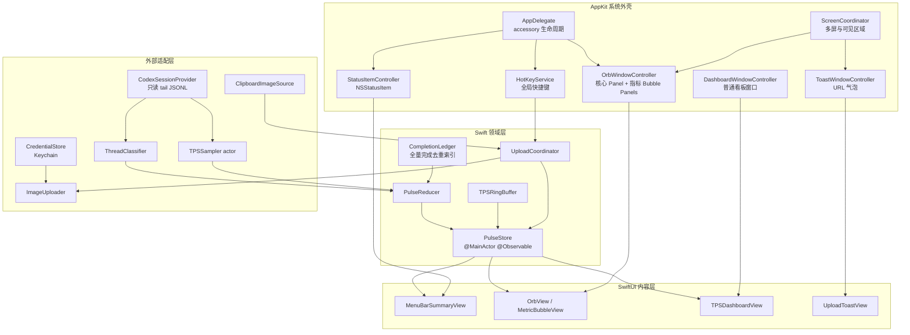
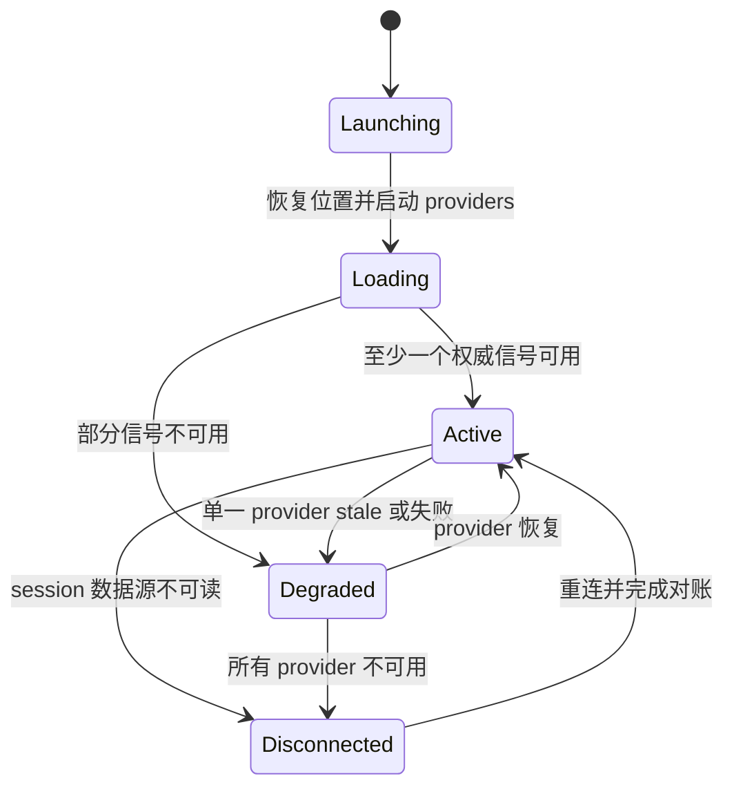
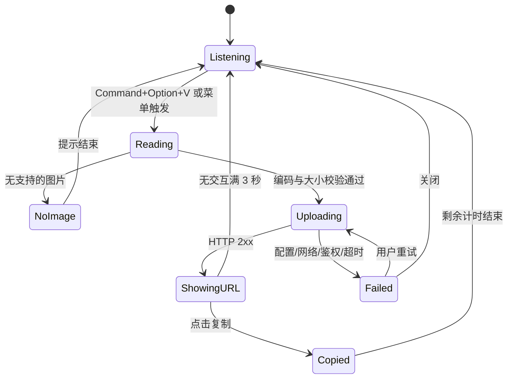

# AgentPulse macOS 交互与架构设计

> 目标平台：macOS 26+
> 文档日期：2026-08-10
> 状态：实现前设计

## 1. 结论与范围

AgentPulse 应采用“AppKit 系统外壳 + SwiftUI 内容视图 + Swift 领域层”的原生混合架构：AppKit 负责菜单栏、全局热键、浮动窗口、屏幕几何和剪贴板接入；SwiftUI 负责指标、悬浮球、气泡和 TPS 曲线；Swift actor 与 `@MainActor` 状态仓库负责采集、聚合和并发隔离。

最小完整版本包含：

- 菜单栏紧凑展示 Codex Desktop 活跃数、全量非 automation 去重完成总数、Terminal 活跃数、实时输出 TPS。
- 一个可拖拽、跨 Space 常驻的圆形悬浮球；点击后在其周围展开四个指标气泡。
- 一个按需打开的 TPS 曲线看板。
- 全局 `Command + Option + V`：读取剪贴板首张图片、上传、弹出可复制 URL；成功气泡在无交互时 3 秒后消失。
- 数据未知、断流、热键冲突、无图片、上传失败、多屏变化和权限拒绝都有明确降级，不以 `0` 伪装未知状态。

不在本设计范围内：修改 Codex Desktop、读取会话正文、屏幕截图、automation 管理、历史分析报表、云端同步和上传服务后端实现。

当前仓库使用 Swift 6.3，已拆出 `AgentPulseCore` 与 `AgentPulseR2`，并有 `Info.plist` 和把 SwiftPM release executable 封装为 `.app` 的脚本；应用入口仍是 Hello World。实现前应把现有脚本补齐为可复现的 Developer ID 签名、公证与发布链路，并将 Package/Info.plist 现有的 macOS 14 最低版本统一提升到本需求的 macOS 26。核心状态模型应扩展现有 `AgentPulseCore`，上传协议与 R2 具体实现继续留在 `AgentPulseR2`，避免重复模块。

## 2. 关键产品语义

四项指标必须先有稳定语义，再投影到不同界面：

| 指标 | v1 定义 | 未知/陈旧处理 |
|---|---|---|
| Codex Desktop active | `originator == "Codex Desktop"` 的顶层 turn 中，存在 `task_started` 且尚无同 `turn_id` 的 `task_complete`；显示活跃 turn 数 | 数据目录不可读或格式不支持时显示 `—`；不能显示 inactive |
| non-automations completed | 所有可读历史 session 中完成的顶层非 automation turn 总数；以 `session_id + turn_id` 全量去重，跨日期、重启不清零，subagent 完成不单独计数 | 无法可靠分类 automation 的事件不计入，指标标记为 partial |
| terminal active | `originator == "codex_exec"` 的顶层 turn 中，尚未完成的数量 | 若目标版本的元数据不能区分 terminal，则显示 `—`，不得用前台应用猜测为权威值 |
| TPS | 所有被跟踪活跃 turn 的累计 `output_tokens` 增量之和除以采样间隔；显示 5 秒 EMA，曲线保留原始 1 秒桶 | 有心跳但无增量为 `0`；超过 3 秒无样本为 stale；数据源断开为 `—` |

本机 Codex session JSONL 已出现 `session_meta`、`task_started`、`task_complete` 与 `token_count`；其中 token 信息包含累计和最近一次的 `output_tokens`。采集器只解析这些状态/用量字段，原始正文不进入领域状态、日志或持久化。

automation 分类必须是显式规则，例如未来元数据提供明确的 thread kind。禁止依赖标题、提示词、目录名等启发式字符串。分类结果采用 `interactive / automation / subagent / unknown`；只有 `interactive` 计入完成数。

## 3. 总体组件图



数据只沿 `Provider -> 领域事件 -> Reducer -> Store -> View` 单向流动。SwiftUI 视图不直接 tail 文件、不持有窗口对象、不执行上传；窗口控制器不计算业务指标。

## 4. SwiftUI 与 AppKit 边界

| 能力 | 边界 | 设计决定 |
|---|---|---|
| 菜单栏 | AppKit | 创建 `NSStatusItem` 后将其 `length` 设为 `NSStatusItem.variableLength`；button 承载紧凑摘要，点击打开详情 popover，右键提供看板、上传、设置、隐藏悬浮球、退出 |
| 悬浮球 | AppKit + SwiftUI | `NSPanel` 管窗口与拖拽，`NSHostingView` 渲染圆形状态核心；四个指标气泡使用独立小 panel，避免一个大透明窗口吞掉下层点击 |
| TPS 看板 | AppKit window + SwiftUI Charts | 普通可成为 key 的窗口，支持 VoiceOver、键盘和窗口管理；关闭窗口不停止采集 |
| URL 气泡 | AppKit + SwiftUI | 默认非激活显示；用户点击后允许成为 key，以便复制、Esc 关闭和 VoiceOver 聚焦 |
| 全局热键 | AppKit/Carbon 适配层 | v1 首选 `RegisterEventHotKey`，避免为单个快捷键索取 Accessibility；注册失败必须可检测并降级 |
| 剪贴板 | AppKit 适配层 | 仅在用户触发上传时读取 `NSPasteboard`，不轮询、不读取无关文本 |
| 状态与并发 | Swift 6 | 文件监听、解析、TPS 聚合、上传分别使用 actor；只发送 `Sendable` 值；所有可观察 UI 状态在 `@MainActor` 更新 |

不建议使用纯 `MenuBarExtra`：它不足以统一处理紧凑自绘摘要、左右键语义和多个自定义 panel。也不建议用 `CGEventTap` 作为默认热键方案，因为它会扩大权限面；仅在未来快捷键 API 不可用且用户明确授权时作为备用实现。

## 5. 采集与状态聚合

### 5.1 Session tail

`CodexSessionProvider` 首次启动扫描全部可读历史 session 文件，之后依据持久化 checkpoint 增量读取，并通过目录事件通知 tail 新内容。活跃状态只需对未完成 turn 对账；completed 总数由 `CompletionLedger` 保存已确认的 `session_id + turn_id`、分类和完成时间等最小元数据。解析必须满足：

- 按 `session_id + turn_id` 建立状态，重复行幂等。
- 文件截断、轮转或 inode 变化时重新对账，不把累计 token 的重置当负 TPS。
- 未知 JSON 字段忽略；关键字段缺失时仅将该信号降级为 unknown。
- 首次全量回放建立 completed 去重索引；后续重启从 checkpoint 恢复。跨午夜不清零，历史文件移动、重复读取或事件重放不能重复计数。
- 原始行解析后释放；日志只保留事件类型、匿名 operation ID、时间和错误类别。

### 5.2 TPS

每个 session 保存最后一次累计 `output_tokens` 与时间戳。新样本到达时：

1. `delta = max(0, currentTotal - previousTotal)`；检测到回退则视为基线重置。
2. 将 delta 分配到统一墙钟时间轴的 1 秒桶，再按同一桶汇总所有活跃 session；不能先用各 session 不同间隔算速率再直接相加。
3. 菜单栏显示最近 5 秒 EMA；看板显示最近 15 分钟、最多 900 个 1 秒点。
4. UI 最多每 250 毫秒发布一次状态；无新 token 但数据源健康时自然衰减至 0。

这样既保持“实时感”，又避免每条 JSONL 都触发 SwiftUI 重绘。

### 5.3 领域状态

```text
MetricState<Value> = loading | live(Value) | stale(lastValue) | unavailable(reason)
AppHealth = idle | active | degraded | disconnected
UploadState = idle | readingClipboard | uploading(progress?) |
              succeeded(url, expiresAt) | failed(retryable, message)
```

悬浮球核心颜色只表达 `AppHealth`，同时配合形状和文字：active 为实心脉冲、degraded 为琥珀缺口环、disconnected 为灰色断环，避免只靠颜色传意。

## 6. 交互与状态流

### 6.1 主状态流



菜单栏始终存在。首帧为 `—` 而非 `0`；状态恢复自动完成，不要求重启应用。

### 6.2 悬浮球

- 默认直径 48 pt，最小点击目标不小于 44 pt；单击展开或收起四个指标气泡，双击打开 TPS 看板。
- 按下移动小于 4 pt 视为点击，达到 4 pt 进入拖拽；拖拽时收起气泡。
- 松手后吸附最近屏幕左右边缘，保留 8 pt 安全间距。存储 `screenStableID + visibleFrame 内归一化坐标 + edge`，而非绝对像素。
- 气泡优先朝屏幕内部展开；布局器尝试右、左、下、上四个候选方向，选择全部落入 `visibleFrame` 且与核心不重叠的方案。
- 点击外部、按 Esc、开始拖拽或打开看板时收起气泡。透明区域不创建窗口，因此不阻挡下层应用。

### 6.3 TPS 看板

- 从菜单、悬浮球双击或指标气泡打开，默认显示最近 15 分钟。
- 曲线固定纵轴从 0 起，上界随窗口内 P95 向上取整，尖峰仍以标记保留。
- stale 时冻结最后曲线并覆盖“数据暂停”；恢复后续接，不清空历史。
- 看板关闭仅销毁视图/窗口，ring buffer 和采集继续运行。

### 6.4 剪贴板图片上传



上传规则：

- 读取首个 PNG/JPEG；其他可解码图片统一编码为 PNG。编码后再检查 MIME、扩展名和大小。
- 上传中再次触发快捷键只聚焦现有进度气泡，不创建第二个上传；用户可显式取消后重试。
- 成功 URL 气泡锚定悬浮球；悬浮球隐藏时锚定鼠标所在屏幕的右上安全区。
- 3 秒从成功气泡实际显示后开始；鼠标悬停、VoiceOver 聚焦或键盘焦点进入任一条件成立即暂停，全部条件解除后才继续剩余时间。无交互时应在 3 秒内消失。
- 点击“复制”仅把公开 URL 写入剪贴板，并把按钮短暂改为“已复制”；不得复制预签名 URL。
- 失败气泡不受 3 秒限制，提供可操作错误与关闭；日志不记录图片、凭证、签名 URL 或完整公开 URL。
- 可分发版本优先使用服务端签发的短时、单对象预签名 PUT；若本机模式直接上传，长期凭证只能保存在 Keychain。

## 7. 窗口层级、多屏与 Spaces

| 窗口 | level / 激活 | collection behavior | 说明 |
|---|---|---|---|
| 悬浮球与指标气泡 | `.nonactivatingPanel` + `.borderless`，level 为 `.floating` | `.canJoinAllSpaces`, `.fullScreenAuxiliary`, `.stationary` | 高于普通应用、低于系统菜单；不使用 `.statusBar`，避免覆盖菜单和系统 UI |
| URL 气泡 | `.nonactivatingPanel` + `.borderless`，level 为 `.floating`；显示时不抢焦点，交互时子类允许成为 key | 同悬浮球 | 始终限制在当前屏幕 `visibleFrame` |
| TPS 看板 | `.normal`，用户打开时激活 | 默认窗口行为 | 可被 Stage Manager、Mission Control 和 VoiceOver 正常管理 |

`ScreenCoordinator` 监听屏幕参数变化。屏幕拔出、分辨率/缩放变化、菜单栏或 Dock 所在屏变化后，将所有 panel 重新夹取到有效 `visibleFrame`；找不到原屏时回落到主屏最近边缘。全屏应用中的浮窗可由用户通过“在全屏空间显示”设置关闭，避免演示或会议遮挡。

## 8. 权限、分发与安全边界

推荐 v1 使用 Developer ID 签名、公证、非 App Sandbox 分发，因为只读 `~/.codex/sessions` 是核心数据源。该模式仍须最小权限：

| 能力 | v1 是否需要系统隐私授权 | 说明 |
|---|---:|---|
| 读取本用户 `~/.codex/sessions` | 否，非沙盒正常文件权限即可 | 若进入 App Sandbox，必须让用户选择目录并保存 security-scoped bookmark |
| `RegisterEventHotKey` | 否 | 不申请 Accessibility 或 Input Monitoring；启动时检查注册结果 |
| 读取剪贴板图片 | 否 | 仅在明确热键/菜单动作后读取；不轮询 |
| 上传 HTTPS | 否 | 沙盒版本需 network client entitlement |
| 屏幕录制 | 否 | 当前需求不截图，不应申请 |
| Accessibility | 否 | 核心能力不依赖 UI 抓取或 event tap，不应主动申请；若未来显式启用 `CGEventTap` 备用路径，须单独说明并由用户授权，不属于 v1 默认路径 |
| Keychain | 否 | 保存上传凭证；拒绝/锁定时上传降级，不影响指标采集 |

`HotKeyService` 必须检查 `RegisterEventHotKey` 返回的 `OSStatus`，非 `noErr` 立即报告注册失败。由于成功注册也不能证明组合键一定能送达，设置页还提供“测试快捷键”：用户在限定时间内按下组合键，收到事件才标记可用，超时则提示疑似冲突并允许改键。始终保留“上传剪贴板图片”菜单项。禁止静默改键，也禁止通过监听全部键盘事件绕过冲突。

## 9. 无障碍与系统偏好

- 每个菜单指标、气泡、曲线摘要和 URL 都提供明确的 `accessibilityLabel` 与 `accessibilityValue`，例如“实时输出，每秒 42 token，数据正常”。
- 颜色之外始终保留图形/文字状态；支持 Increase Contrast、Differentiate Without Color 和浅深色模式。
- Reduce Motion 下取消脉冲、弹簧和曲线插值，只保留即时或淡入变化。
- TPS 看板提供“当前值、峰值、平均值、数据是否陈旧”的文本摘要，不能要求 VoiceOver 用户读取曲线。
- URL 气泡可通过 VoiceOver 聚焦复制按钮；一旦被辅助技术聚焦，自动消失计时暂停。
- 提供菜单入口完成上传、打开看板、隐藏/显示悬浮球和重置悬浮球位置，使所有关键功能不依赖鼠标拖拽或记忆热键。
- 状态更新不抢 VoiceOver 焦点；只对连接丢失、上传成功/失败等离散事件发送克制的 announcement。

## 10. 建议文件边界

```text
Sources/AgentPulse/
  AgentPulseApp.swift                 # 替换现有 Hello World 入口
  AppKit/
    StatusItemController.swift
    FloatingPanel.swift
    OrbWindowController.swift
    DashboardWindowController.swift
    ToastWindowController.swift
    ScreenCoordinator.swift
  Views/
    MenuBarSummaryView.swift
    OrbView.swift
    MetricBubbleView.swift
    TPSDashboardView.swift
    UploadToastView.swift

Sources/AgentPulseCore/
  Domain/
    PulseEvent.swift
    PulseState.swift
    PulseReducer.swift
    PulseStore.swift
  Providers/
    StatusProvider.swift
    CodexSessionProvider.swift
    SessionJSONLDecoder.swift
    JSONLTailer.swift
    ThreadClassifier.swift
    TPSSampler.swift
  Upload/
    ClipboardImageSource.swift
    UploadCoordinator.swift
    ImageUploader.swift
    CredentialStore.swift
  Support/
    TPSRingBuffer.swift
    ScreenPlacement.swift
    RedactedLogger.swift
    CompletionLedger.swift

Sources/AgentPulseR2/                 # 沿用现有上传模块
  ClipboardImageEncoder.swift
  R2Uploader.swift
  R2ConfigurationLoader.swift
  CredentialStore.swift               # 新增 Keychain 或预签名授权适配

Resources/
  Info.plist                          # 沿用现有 LSUIElement；最低版本改为 26
scripts/
  package-app.sh                      # 沿用并补齐签名、公证、发布配置

Tests/AgentPulseCoreTests/
  PulseReducerTests.swift
  SessionJSONLDecoderTests.swift
  TPSSamplerTests.swift
  ThreadClassifierTests.swift
  UploadCoordinatorTests.swift
  ScreenPlacementTests.swift
```

`AgentPulse` executable target 只含系统对象与组合根；Core 不依赖 AppKit 窗口类型。`NSPasteboard` 的生产实现放在 executable target，上传协议放在 Core，R2/Keychain 具体适配留在现有 R2 target。单文件优先控制在 200–500 行，解析、采集、聚合不能堆入 `AppDelegate`。

## 11. 验收标准

### 数据与菜单栏

- [ ] 冷启动 2 秒内出现菜单栏项且无 Dock 图标；首次采集前四项显示 `—`，不误报为 0。
- [ ] 使用固定 JSONL fixture：Desktop/terminal 的 `task_started` 后 1 秒内 active 数 +1，同 `turn_id` 的 `task_complete` 后 1 秒内 -1。
- [ ] 契约 fixture 中，当 `ThreadClassifier` 分别输出 interactive、automation、subagent、unknown 时，只有 interactive 完成计一次；重复事件不重复计数。真实 automation 分类正确性须待权威字段确认后另行验收。
- [ ] 首次导入全部历史 fixture 后得到全量去重完成总数；跨重启、跨午夜、重复回放和文件重扫均不清零、不重复计数，新增唯一 interactive 完成才使总数 +1。
- [ ] 给定累计 output token 与时间序列，1 秒桶计算精确，菜单 EMA 在测试容差内；停止 token 增长后显示 0，数据源断开 3 秒后显示 stale/`—`。
- [ ] JSONL 增加未知字段、缺少非关键字段、截断或轮转时应用不崩溃，受影响指标独立降级并可恢复。

### 悬浮球、看板与多屏

- [ ] 悬浮球可点击、拖拽、贴边并跨重启恢复；小于 4 pt 位移不误判为拖拽。
- [ ] 四个指标气泡数值与菜单栏来自同一 Store，展开时全部位于所在屏幕 `visibleFrame`。
- [ ] 透明区域不阻挡下层应用；悬浮球跨 Space 可见，且可关闭全屏显示行为。
- [ ] 副屏拔出、缩放变化或 Dock/菜单栏迁移后，所有 panel 在 1 秒内回到有效屏幕。
- [ ] TPS 看板展示最近 15 分钟且内存点数有界；断流冻结并标记 stale，恢复后续接；关闭看板不停止采集。

### 热键与上传

- [ ] 在其他应用前台时，`Command + Option + V` 能触发；`OSStatus != noErr` 时立即警告，“测试快捷键”超时也提示疑似冲突，并提供备用热键和菜单入口。
- [ ] 剪贴板为空、非图片、图片超限、凭证缺失、网络失败、鉴权失败和取消都有稳定状态，不崩溃、不泄密。
- [ ] 上传中重复触发不产生并发重复对象；显式取消会终止网络任务。
- [ ] HTTP 2xx 后出现公开 URL 气泡；复制按钮写回完全相同的公开 URL；无交互时从显示起 3 秒消失。
- [ ] hover、键盘或 VoiceOver 聚焦暂停剩余计时；离开后继续，而不是重新开始 3 秒。
- [ ] 日志和磁盘中不存在图片数据、长期凭证、Authorization、预签名 URL 或完整公开 URL。

### 权限、性能与无障碍

- [ ] 核心路径不请求 Screen Recording、Accessibility、Input Monitoring 或 Full Disk Access。
- [ ] 数据目录不可读或 Keychain 被拒绝时，仅相关能力降级，菜单、退出和设置仍可用。
- [ ] 连续运行 8 小时后，JSONL offset、TPS ring buffer 和窗口数量有界；空闲时无高频轮询，UI 更新不超过 4 次/秒。
- [ ] VoiceOver 可朗读四项指标、看板文本摘要和 URL 复制操作；键盘可完成所有非拖拽功能。
- [ ] Reduce Motion 与 Increase Contrast 下信息完整，无仅靠颜色或动画表达的状态。

## 12. 风险、未知项与实施顺序

| 优先级 | 风险/未知 | 处理方式 |
|---|---|---|
| 高 | automation 在目标 Codex 版本中的权威分类字段尚未确认 | 保持 `ThreadClassifier` 独立；未确认前显示 partial，不用启发式误计 |
| 高 | terminal active 是否专指 Codex CLI turn 尚需产品确认 | v1 将 `codex_exec` 定义写入 UI 帮助；Provider 可替换，不影响视图 |
| 高 | 现有打包脚本只有本机 ad-hoc codesign，且最低系统版本仍为 14 | 统一提升到 macOS 26，补 Developer ID 签名、公证和可复现发布验证，再开发浮窗 |
| 中 | session JSONL 可能随 Codex 版本变化 | 防御式 decoder、版本化 fixtures、逐指标降级 |
| 中 | Carbon 热键 API 的长期兼容性 | macOS 26 CI/真机冒烟；保留协议化替代实现和菜单入口 |
| 中 | 常驻浮窗干扰全屏/演示 | 提供一键隐藏、全屏显示开关和位置重置 |
| 中 | `.floating` 低于第三方置顶窗，不能保证任何场景都在最上层 | 接受“低于系统菜单”的安全权衡；验收以普通应用和系统全屏为边界，不升级到 `.statusBar` |

建议实施顺序为：App bundle 与状态栏壳 -> JSONL fixture/decoder -> reducer 与四项菜单指标 -> 悬浮球/多屏 -> TPS 看板 -> 热键与剪贴板 -> 上传与 Keychain -> 无障碍、性能和 8 小时稳定性验证。每一步都可用协议 fake 和 Swift Testing 独立验收。
